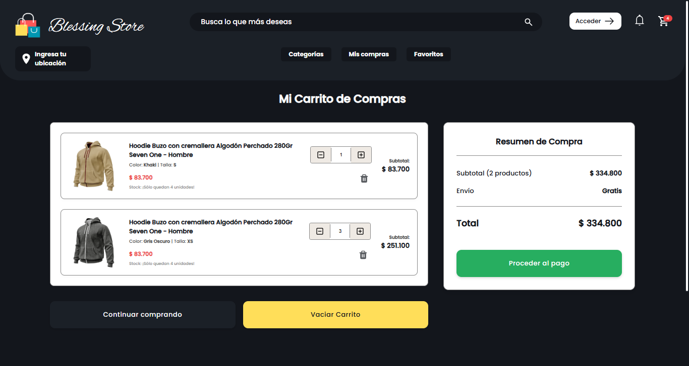

# 🌟 Blessing Store – Visual Commerce Experience

## 🖼️ Vista Previa

---

## 💡 Visión General

> *"Estamos construyendo algo grandioso."*

**Blessing Store – Visual Commerce Experience** es una iniciativa de rediseño visual y estructural de la tienda virtual "Blessing Store", orientada a brindar una **experiencia de usuario moderna, mantenible y escalable**. Se abandona el enfoque anterior —basado en HTML/CSS/JS sin modularidad ni reutilización— para adoptar un stack frontend profesional centrado en **React**, con una arquitectura basada en **componentes reutilizables**, **navegación controlada**, y una estructura visual coherente y extensible.

Este proyecto **no depende del backend legado**, aunque mantiene la visión de construir una plataforma robusta para el comercio electrónico. Aquí, el foco está en la presentación, navegación y experiencia de usuario como pilares fundamentales para su evolución futura.

---

## 🎯 Propósito del Rediseño

La versión anterior de la tienda presentaba problemas clave:

- 🔁 **Duplicación de código**: Estructuras repetidas como `header`, `footer`, y layout en múltiples páginas.
- 📉 **Escasa mantenibilidad**: Cada cambio visual requería modificaciones manuales en muchos archivos.
- ⚠️ **Falta de navegación estructurada**: No existía un enrutamiento declarativo ni control sobre el flujo de navegación.
- 🧱 **Poca escalabilidad**: Dificultad para crecer hacia nuevas secciones o integrar nuevas tecnologías.

El nuevo enfoque resuelve estos puntos mediante:

- **Modularidad con React**: Componentes como `<Header />`, `<Footer />`, `<Card />`, etc. permiten centralizar y reutilizar la UI.
- **React Router**: Navegación fluida entre rutas con manejo de secciones en desarrollo.
- **Diseño adaptable**: Aunque aún no responsive, la estructura se adapta fácilmente a futuros rediseños.
- **Estrategia de comunicación visual**: Implementación de una sección intermedia para rutas aún no implementadas, con el mensaje "Estamos construyendo algo grandioso" como parte de una experiencia de producto honesta y bien pensada.

---

## 🧩 Componentes y Estructura

El proyecto está estructurado en torno a una arquitectura por componentes. Cada parte del sitio —menú, productos, pie de página, banners— se construye como una unidad independiente que puede ser reutilizada y probada por separado.

### 🧱 Componentes principales

- `Header`: Barra de navegación principal con enlaces y logotipo.
- `Footer`: Pie de página con enlaces de interés, políticas y contacto.
- `Banner`: Componente visual destacado para la portada.
- `Card`: Representación visual de productos o categorías.
- `RoutePreview`: Componente informativo temporal para rutas en desarrollo.
- `Layout`: Envoltura base que agrupa estructura principal (`<Header />`, `<Footer />`, `<Outlet />`).

Esta separación permite una **gestión ordenada del código fuente**, facilitando el mantenimiento, las pruebas y la evolución del proyecto.

---

## 🔍 Navegación Visual e Informativa

En lugar de generar errores de página no encontrada (404) o enlaces rotos, las rutas aún no implementadas se comunican con un mensaje claro:  
> **“Estamos construyendo algo grandioso”**

Esta decisión mejora la experiencia del usuario y aporta transparencia al proceso de desarrollo continuo. La idea no es ocultar la falta de funcionalidad, sino mostrar que el sitio está **en evolución activa**, generando confianza y expectativa.

---

## 🛤️ Rutas y Secciones Planeadas

Aunque actualmente se trabaja sobre el diseño visual, las rutas están ya configuradas para facilitar futuras expansiones. Entre las vistas planificadas se encuentran:

### 🛍️ Catálogo de Productos
- Hombre / Mujer / Niños / Bebés

### 🙍‍♂️ Gestión del Usuario
- Mis pedidos / Comprobantes / Favoritos

### 🔐 Autenticación
- Registro / Inicio de sesión

### 📦 Carrito y Compras
- Carrito de compras
- Métodos de pago
- Confirmación de pedido

### 📄 Información Institucional
- Sobre nosotros
- Políticas de privacidad
- Términos y condiciones

### 🤝 Soporte al Cliente
- Preguntas frecuentes (FAQ)
- Contacto
- Reembolsos / Garantías

### 🔎 Buscador Inteligente
- Búsqueda en tiempo real
- Filtros por talla, precio, categoría
- Sugerencias dinámicas

---

## 🛠️ Stack Tecnológico

### ⚛️ Frontend

- **React 18+** – Biblioteca base para construir interfaces de usuario mediante componentes
- **JSX** – Sintaxis que mezcla JavaScript con estructuras similares a HTML para definir interfaces declarativas
- **JavaScript (ES6+)** – Lógica de aplicación y manipulación de datos
- **HTML semántico (vía JSX)** – Estructura visual del contenido accesible y legible
- **React Router DOM** – Control declarativo de rutas y navegación
- **CSS clásico** – Estilización directa, con posibilidad de migrar a TailwindCSS o CSS-in-JS
- **Vite o Create React App** – Herramientas modernas para bundling y desarrollo local

---

## 🚧 Estado Actual

| Módulo               | Estado        | Notas                                                |
|----------------------|---------------|------------------------------------------------------|
| Estructura base      | ✅ Completa    | Layout general, enrutamiento y diseño implementados |
| Header/Footer        | ✅ Reutilizables | Mismo componente en todas las vistas               |
| Rutas informativas   | ✅ Agregadas   | Secciones "en construcción" con mensaje visual      |
| Responsive           | ⚠️ Pendiente   | Layout actual solo para escritorio                  |
| Autenticación        | ⏳ Planeada    | Ruta definida, funcionalidad aún no conectada       |
| Catálogo de productos| ⏳ En diseño   | Estructura preparada para conexión con backend      |

---

## ✅ Ventajas del Nuevo Enfoque

- 💡 **Mayor claridad estructural**
- 🧼 **Menos código repetido**
- 🔁 **Componentes reusables**
- 🔄 **Facilidad para escalar**
- 🛠️ **Mantenimiento más simple**
- 🌐 **Navegación declarativa y controlada**

---

## 📌 Conclusión

Esta versión de Blessing Store sienta las bases para una plataforma sólida de comercio electrónico centrada en el usuario. No solo se trata de vender productos, sino de ofrecer una **experiencia visual coherente, moderna y transparente**, tanto para el usuario final como para el equipo de desarrollo.

> 🌟 *Blessing Store no es solo una tienda, es una experiencia que evoluciona contigo.*